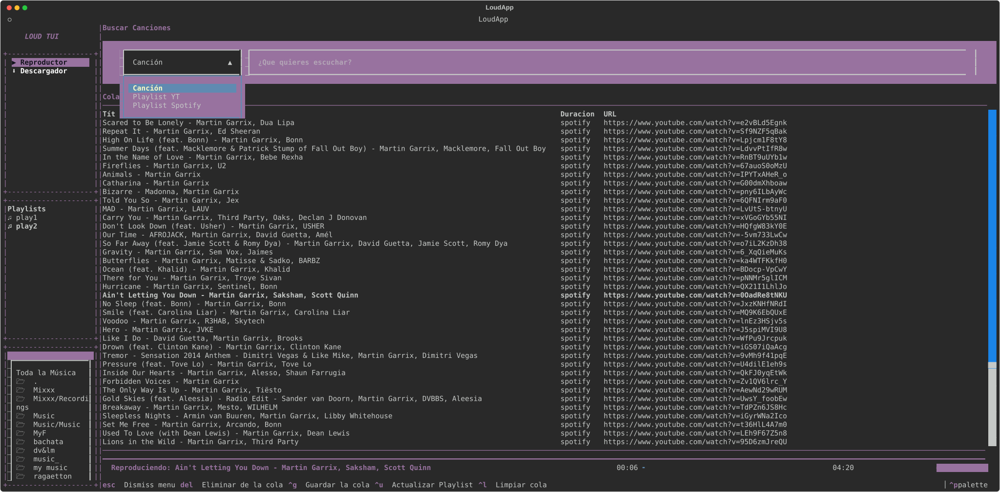

# LOUD TUI

<p align="center">
  
</p>

<p align="center">
  <b>Un reproductor de música TUI ligero, rápido y moderno para la terminal.</b><br>
  Construido con Python + Textual y alimentado por el motor multimedia de mpv.
</p>

<p align="center">
  <a href="#-características"></a>
  <a href="#-requisitos-previos"></a>
  <a href="#-licencia"></a>
</p>

---

## Vista Previa

**LOUD** combina la potencia de la reproducción de audio en segundo plano con una interfaz de usuario (*Terminal User Interface*) responsiva, elegante y basada en la paleta de colores de tu sistema. 

Gestiona tanto tu **biblioteca local de música** como búsquedas y streaming directo desde la misma cola de reproducción.

---

## Características

* **Explorador de Música Local:** Navegación por directorios (`~/Música`) e inserción rápida de canciones a la cola de reproducción.
* **Búsqueda y Streaming Integrado:** Busca e integra canciones remotas directamente en la misma lista sin interrumpir la reproducción.
* **Reproducción Ultra Ligera (mpv):** Utiliza un socket IPC en segundo plano con `mpv`, garantizando un consumo mínimo de CPU y RAM.
* **Temas Dinámicos:** Compatible nativamente con la paleta de colores de Textual y la paleta de temas nativa (`Ctrl + p`).
* **Controles por Teclado:** Atajos intuitivos diseñados para operar sin tocar el ratón.
* **Cola de Reproducción Unificada:** Soporta simultáneamente URLs de streaming y rutas absolutas locales sin errores de tipo.

---

## Requisitos Previos

# Antes de instalar LOUD, asegúrate de tener instalados **Python 3.10+** y el reproductor **mpv**.


# Instalación paso a paso:
### En distribuciones basadas en **Debian / Ubuntu / Linux Mint**:
```bash
sudo apt update
sudo apt install -y python3 python3-pip python3-venv mpv
```
### Descarga el .deb e instala:

``` bash
sudo apt install loud.deb
```
#### Una vez instalado solo ejecuta:
``` bash
loud
```
### Tambien puedes clonar el proyecto y hacerlo a tu modo:

### 1. Clonar el repositorio
```bash
git clone https://github.com/Lizandr0/loud.git
cd loud
```

### 2. Crear y activar el entorno virtual
```bash
python3 -m venv venv
source venv/bin/activate
```

### 3. Instalar dependencias
```bash
pip install -r requirements.txt
```

# Uso Rápido:
## Con el entorno virtual activado, ejecuta:
```bash
python3 main.py
```
